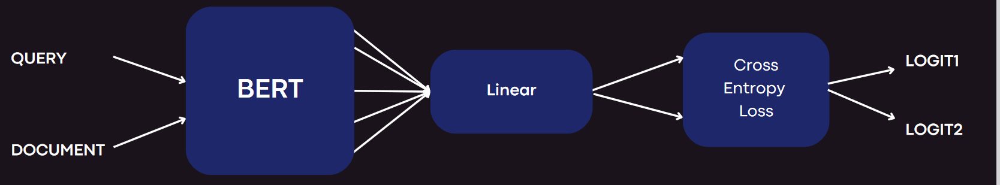
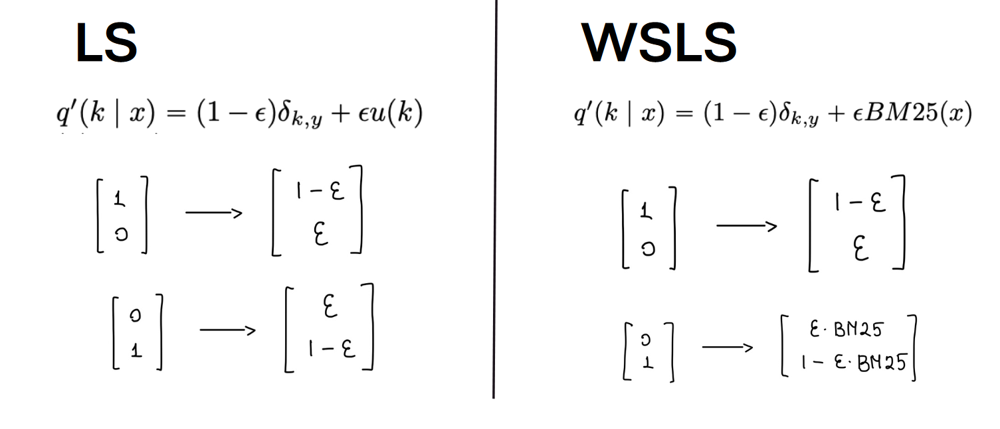
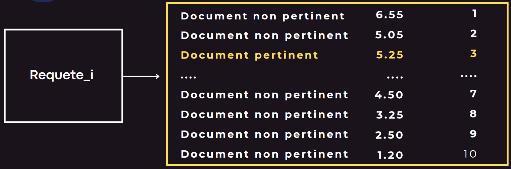
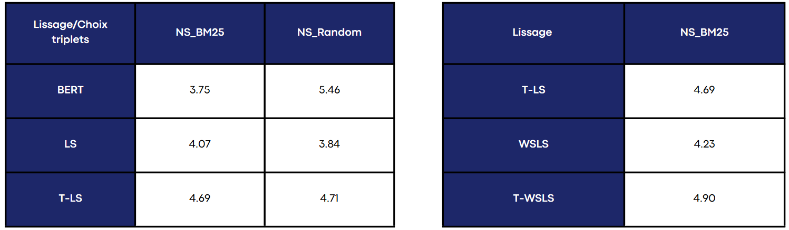

# Weakly Supervised Label Smoothing
## Description

Ce projet tente de réimplémenter le papier de recherche [**Weakly Supervised Label Smoothing**](https://arxiv.org/abs/2012.08575). 

Ce modèle présente le Weakly Supervised Label Smoothing (WSLS), technique de regularisation variante du Label Smoothing (LS) simple. 
Celle-ci regularise plus fortement les documents non pertinents ayant un score BM25 élevé. 

Nous tentons donc de répondre à ces deux questions: 

**RQ1** : Le Label Smoothing est-il un régulariseur efficace
pour les modèles neuronaux de classement de rang (L2R), et si
oui, dans quelles conditions ?

**RQ2** : Le WSLS est-il plus efficace que le LS pour
l'apprentissage des modèles neuronaux de classement de rang
(L2R) ?

De plus, ne disposant pas des ressources de calculs des auteurs originaux, nous tentons de reproduire ces résultats avec beaucoup moins de données. 

## Modèle

Nous utilisons un modèle Learning to Rank basé sur BERT. 

## Negative Sampling
Nous utilisons deux méthodes différentes de Negative Sampling : C'est à dire la méthode avec laquelle nous choisissons pour une requête les documents **non pertinents** associé lors de l'entrainement.  

**NS_Random** : Au hasard parmi tout les documents non pertinents de la base

**NS_BM25** : On sélectionne les documents non pertinents au score BM25 le plus élevé

## Techniques de Lissage des Étiquettes (LS et WSLS)

Nous pouvons voir que WSLS regularise plus fortement les documents non pertinents ayant un score BM25 élevé. 
Au niveau de l'implmentation, la régularisation est integré dans la loss (Cross entropique dans tout les cas). 

Nous testons une variante supplémentaire de ces deux méthodes **T-LS** et **T-WSLS**, où la régularisation est arrêté après un certain nombre d'époque 

## Protocole d'Évaluation

1. Collection des données libre accès -> MS-MARCO-Hard-Negatives.jsonl
2. A partir des données, génération de triplets (qid, pid, relevance) en fonction du Negative Sampling
3. Pour chaque requête on considère 1 triplet pertinent et 9 non-pertinents
4. Apprentissage du modèle L2R et Lissage d'étiquettes selon le choix : LS, T-LS, WSLS, T-WSLS
5. Evaluation des performances

## Métrique d'évaluation 

1. Pour chaque requête, on classe les documents en fonction de leur score de pertinence
2. On calcule la position moyenne du documents pertinent dans l'ensemble des documents associé à la requête
3. Le score final est **10 - Avg_pos**. Cela permet qu'un score élevé soit meilleur. 

 
## Résultats et Analyse
- nombre d'epoch = 20
- learning rate = 1e-5
- 50 requêtes (pour un total de 500 triplet)

Voyons si même dans ces conditions très limité, nous reussissons à reproduire les résultats de l'article : 

 

Nous sommes donc maintenant capable de répondre aux questions : 

**RQ1 :** LS est un régularisateur efficace améliorant les performances mais uniquement si l'on utilise NS_BM25 (4.07 contre 3.75). Dans tout les cas, la variante T-LS est meilleure (4.69).

**RQ2 :** WSLS surpasse LS avec NS_BM25 (4.23 contre 4.07). Sa variante T-WSLS surpasse à la fois WSLS mais aussi T-LS (4.90 contre 4.69). 

